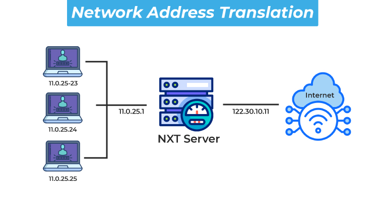

# Networking Terminologies

## Basics

1. `Public IP Addresses` - Identifier of the server to outside world
2. `DNS (Domain Name System)` - Translates easy to remember names into IP Addresses
   1. Internet's Directory
   2. Human Friendly name to machine readable number (Names to IP address)
   3. `Verisign` manages the DB of all the registered domain names (More than 350 Million)
   4. DNS Resolver resolves the url with the IP address
   5. DNS Servers
      1. Root Nameservers (13 RootNameservers in the world)
         1. Stores the IP addresses of the TLD Name Servers
      2. TLD Nameservers
         1. Stores the IP addresses of all the Authoritative name server for all the domains
      3. Authoritative Nameserver
         1. Final source of truth which has the IP addresses
   6. When a DNS Query is made, browser checks the cache, ISP (Internet Server Provider) and if it is not found, the query gets routed to the Root Name Server and that gets routed back to the Top Level Domain Server and then based on the domain it finally goes to the Authoritative name server which sends the IP address and then the connection is made and communication can be established.
3. `Ports` - Numbered channels in the server
   1. Ranges from 1 to 65535
   2. Web Servers listens on port `80`, secured one listens on port `443`
4. `Security and Segmentation`
   1. `Subnets` - Divides the network into different subnets for security and functionality
      1. Frontend server can run in one subnet, DB in one and then Backend server in another
   2. `Routing` - directs traffic from one server to another server
5. `Firewalls` - checks every traffic that enters the server based on configured rules
   1. `Host Firewalls`
   2. `Network Firewalls`
6. `Private IP Addresses` - Works inside the network and it does not communicate with the internet
7. `NAT (Network Address Translation)` - Allows multiple private IP addresses share one public IP address to communicate to the outer world
   1. When a server with a private IP need to send a request and get some data, it requests the NAT which gets the necessary data and then sends it to the requested server.
   2. 

## Cloud Infra

1. `VPC` - Virtual Private Cloud - isolated section from the cloud providers network. (AWS or Azure or GCP)
   1. Contains subnets (Private and Public) and gateways
   2. Uses internet gateway to connect to public subnets to internet
2. `Route Tables` - for public subnets which tells the data where to go.
3. `NAT Gateway` - Placed in the public subnet which allows the private subnets to talk to the internet in the same secured way.

## Containers

1. Communicate with the servers present in the same `bridge` network using container names
2. `Port Mapping` - map the container port to the host port to make sure the server can be accessed
3. `Overlay Networks` - Containers running in different servers can be connected and be accessed as if they are in the same server.

## Kubernetes - automates container management

1. `Services` - provides a stable IP address and permanent DNS name.
2. `Ingress` - Routes the traffic to the correct service based on configured rules.

## IP, TCP, HTTP

1. `IP (Internet Protocol)` - contains source, destination address and data. (Routes Packets)
2. `TCP (Transmission Control Protocol)` - ensure the packets are delivered properly.
3. `HTTP  (Hyper Text Transfer Protocol)` - developer friendly. Abstracted on top of TCP. (Requests and Responses)
4. `TLS (Transport Layer Security)` - This makes HTTP -> HTTPS. Ensure encryption and authentication
   1. Without TLS
      1. Passwords can be stolen
      2. Data can be altered
      3. Fake websites can impersonate real ones
5. On top is `REST` which is an architectural style for modern web applications
