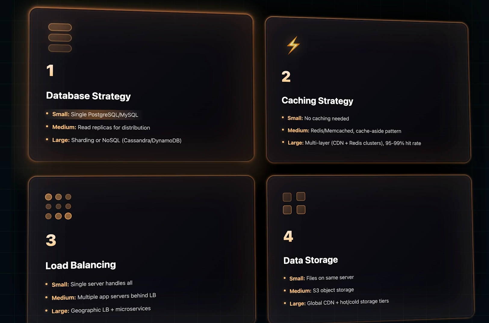
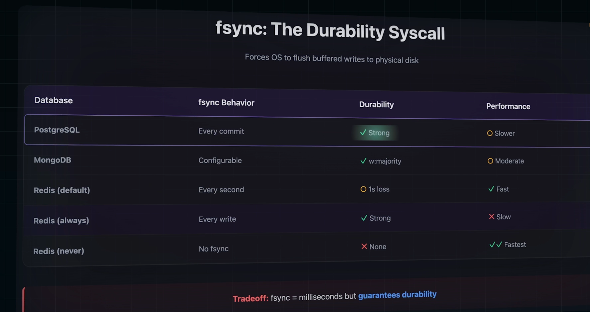

# Non-Functional Requirements

1. `Availability`
   1. The `Number of Nines`, 99%, 99.9%, 99.99%
   2. Measuring availability
      1. SLI - Indicator
         1. Measuring actual request. Request Success Rate: 99.95%, Error Rate: Less than 0.1%
         2. Raw Measurements
      2. SLO - Objective
         1. Internal Target set
         2. Stricter than SLAs
      3. SLA - Agreement
         1. Promise to customers with financial penalities
   3. Error Budget - can use for deployments, remaining time from SLA
   4. High Availability means - Multi-Region Deployment
   5. Database Strategy
      1. 
   6. Examples
      1. 
      2. 
2. `Latency` - how fast can I get the response from the system, measured in ms
   1. 1% loss in Sales from every 100ms of latency
   2. Google discovered when the search is slowed down from 0.4s to 0.9s, the traffic gets decreased by 20%
   3. Measuring latency in percentiles
      1. p50 (Median)
      2. p95
      3. p99
   4. 
   5. Impacts in latency
      1. Geographic distributions - if the p99 <100 ms then it is in need of a multi-region deployment if the users are all around the world
      2. Caching Strategy - careful about cache invalidation
         1. Cache Miss - adds to latency
         2. Cache Hit
      3. Database selection (either in-memory or NoSQL or SQL)
      4. Sync or Async Processing
         1. Good to do
            1. Async is mandatory
            2. Message Queues
      5. Service Communication
         1. Use of gRPC
         2. minimize service hops
         3. call the services in parallel
3. `Scale`
   1. 
   2. Large Scale Systems - Event-Driven
   3. Types of Scaling
      1. Horizontal Scaling
      2. Vertical Scaling
4. `Consistency`

   1. It is about what users sees when a write operation is made
      1. Eventual Consistency - When user updates a profile, the friend sees the old data but after 30s sees the updated one
         1. Replicas agree eventually. Brief stale window
         2. Examples
            1. Social Feeds
            2. View Counts
            3. Profiles
         3. GAIN
            1. Fast Writes, High availability, Better Scale
      2. Strong Consistency - User adds `$100` to his account and then when he checks his savings account, he should only see the updated amount
         1. Every read sees the latest write
         2. Examples
            1. Banking
            2. Flight Booking
            3. Ticket Sales
         3. COST
            1. Higher latency
            2. Lower availability
            3. Slower Writes
   2. When we are looking into the factor for consistency, an important factor to consider is Network Partition as well. When nw is down, both consistency and availability gets affected so from `CAP Theorem` nw should not be compromised. So either choose consistency or availability.
      1. CP - Choices
         1. MongoDB
         2. HBase
         3. etcd
      2. AP - Choices
         1. Cassandra
         2. DynamoDB
         3. Riak
   3. Four Factors
      

5. `Durability`
   1. When a system crashes or network failures or data center down, how should the data be handled.
      1. No Durability
         1. Ex. Ratelimiting counters
         2. Using Redis, Memcached
      2. Single Disk
         1. When Disk failure occurs, no data survives
         2. Ex. SQLite, single PostgreSQL without replica
      3. Sync Replication
         1. Have replicas and write to replica when writing to primary as well
         2. Higher latency
      4. Async Replication
         1. Write to replica in async
         2. Can lose recent write
         3. MySQL async, PostgreSQL async
      5. Multi-Region Replication
         1. Replicate the data in multiple regions
         2. Ex. Google Spanner and CockroachDB
         3. High cost and High latency but highly durable
   2. WAL Flow - `Write-Ahead Log`
   3. Fsync - provides durability at the OS level
      
   4. Two important points in durability
      1. `RPO` - Recovery Point Objective
         1. How much data can you lose?
      2. `RTO` - Recovery ime Objective
         1. How fast must you recover?
   5. Strong Durability - High cost + High latency
6. `Read-Write` Ratio
   1. Storage Engines
      1. `B-Tree` - Optimized for Read
         1. PostgreSQL
         2. MySQL
         3. Optimization Strategies
            1. Aggressive Caching
            2. Read Replicas
            3. Eventual Consistency
            4. Fan-out on Write
      2. `LSM-Tree` - Optimized for Write
         1. Cassandra
         2. Rock DB
         3. Optimization Strategies
            1. Batching and Buffering
            2. Stay Normalized - duplication is not needed
            3. Selective Indexing - Every index slows write
            4. Fan-out on Read
   2. Both read and write heavy - Choose `CQRS`
      1. Command Query Responsibility Segregation
   3. In PostgreSQL use `pg_stat_user_tables` to know the interactive ratio
