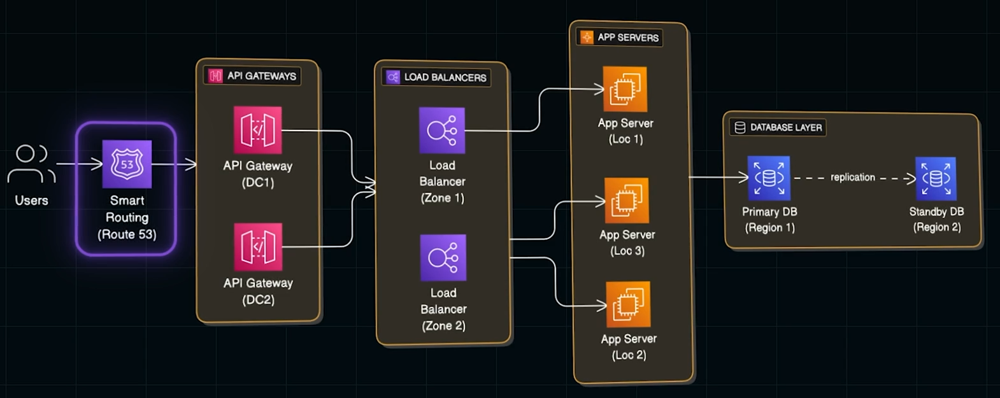

# Some Fundamentals which is used for communication between client and server

1. `Polling`
2. `Long Polling` - Hanging GET
   1. Client sends the requests and the server does not immediately respond.
   2. Instead it holds the request until some changes happen and then sends the response
   3. If there are no changes, the connection gets timed out and a new connection is created.
3. Cons with Polling
   1. At a certain periodic interval a new connection is created.
   2. This makes the operations bit costly.
4. `Web Sockets` on the other hand keeps the connections unique, where server can share the data with the client
   1. Stream messages independently
   2. Asynchronous
   3. Apps
      1. Gaming Apps
      2. Real Time Apps - Stock Trading
      3. Chat Apps
5. `Streaming` vs `WebSockets`
   - `Streaming` or `SSE` is HTTP based and one way. Client opens a connection, server keeps pushing updates. Client mostly listens.
   - WebSocket upgrades from HTTP to a new protocol and is two way. Client and server can both send messages anytime.
   - If the client only needs updates like scores, feeds, logs, use streaming. If the client must send real time data like chat or collaboration, use WebSockets
6. `Caching during Read` - Speed up the application. Prevent the resources getting overloaded.
   1. Client Level
   2. Server Level
   3. CPU Level - Hardware Level
   4. Minimize network calls for frequently accessed data.
   5. Computationally expensive operations could also be cached.
7. `Caching during Write`
   1. Write Through Cache
      1. Edit/Update the cache and then update the cache.
      2. Need to always go to the DB, network calls are not avoided here.
   2. `Write Back Cache`
      1. Server only updates the cache and returns the data
      2. The cache and the DB is not synced now
      3. Asynchronously the server updates the DB. (Depending on the use case)
8. When to cache and when not to
   1. Cache when you have
      1. Static Data
      2. Single Entry for R/W
      3. Consistency is not a matter (YouTube Views)
   2. One should also understand the Cache Eviction Policy
      1. Cache is not as big as the dB. So the stale data must be eliminated. There are many ways to do it, a couple of popular ones are
         1. Least Recently Used (LRU)
         2. Least Frequently Used (LFU)
9. `Hashing`
10. Example where hashing is used
    1. When there are multiple servers and you need to route the request to each servers uniformly we used `Load Balancer`
    2. We employ caching to make sure the computationally intensive operations are not repeated again and again.
    3. Load Balancer chooses the servers based on different techniques - Random based, round robin etc.
    4. Load Balancer need to choose the server for the client and also point to the same server so it can use it from the cache without computing again.
    5. Instead of choosing the random server or based on round-robin fashion, load balancer routes the requests based on hashing functions.
    6. Now if we add another server to the existing list, the hashing changes and the new server will not be able to get the requests and stays without operating.
    7. To avoid this `consistent hashing` is employed.
11. Industry standard hashing functions - `MD 5`, `SHA-1` and `BCrypt`
12. `Latency`
13. Latency is the measure of delay. (Network Latency, Disk and Memory Latency)
    1. Low Latency - Online Games, Video Calls, Trading
    2. Accuracy Matters - Airline booking, online transaction
14. Question to ask during System Design - `How latency-sensitive is the system?`
    1. High Sensitive - use caching, CDNs, edge computing, in-memory databases
    2. Low Sensitive - Consistency, reliability and cost optimization matters
15. `Throughput` 1. It measures capacity 2. How much the system will be able to handle in the given amount of time 3. Eg:- Number of requests that the system can handle (500 req/sec) 4. Ways to improve throughput - Batch requests, Vertical and Horizontal Scaling
    
16. `Replication`
    1. Data is the heart of the system. If the DB of the system is down, then the system is also down.
    2. Here is where replication is majorly taken place. It ensures to have a copy of the DB so when the primary DB is down, the secondary one could be used.
    3. The replica should also have the same data and should always be sync with the primary one.
    4. When the server writes to the DB, it should also be written to the replica.
    5. When the write to replica fails, the transaction should be handled. Write time now increases.
    6. Depending on the use case, write to replica could be done either sync or async.
17. `Redudancy` - Avoid Single Point of Failure
    
18. `Pre-Signed URLs`
    1. When uploading huge volume of data, typical approach - send to server -> server uploads to the cloud storage
    2. There is latency by 2x and then application server gets loaded a lot than expected and might be a bottleneck when more number of users upload a files simultaneously like `You Tube`
    3. To handle this a Fundamental Cloud Pattern is using pre-signed URLs.
    4. When the upload request is made - the server generates a URL and sends to the client. The client then uses this URL and then uploads the file directly to the cloud storage.
    5. The file transfer will be `Cryptographically secure` and also separates the concerns `Control Plane` and `Data Plane`
    6. 
19. `Heartbeats`
    1. It is nothing but a status check if the server is alive or not.
    2. Applications sends that it is alive to particular servers as heartbeat and ensures it is up and working.
    3. If the status is not sent for 3 heartbeats - the other server takes decisions based on this. Helps in
       1. Routing Decision
       2. Failure Detection
    4. Implementation Approaches
       1. Push-Based from server itself - broadcasts at regular intervals. Heavy traffic
       2. Pull-Based from central monitor- Polling - slower detection
       3. With Ack - Monitor sends the request, server responds with Ack message. Introduces traffic
       4. Quorum based - takes decisions if there is a majority confirmation that the system is alive. Reduces false positives but it is high overhead. Used in very critical systems
    5. Sweet Spot to send hot-spots is 5 to 10s and 3 missed heartbeats.
    6. Other Patterns
       1. `Ping-based`
       2. `Gossip Protocol`
       3. `Leader-Based`
