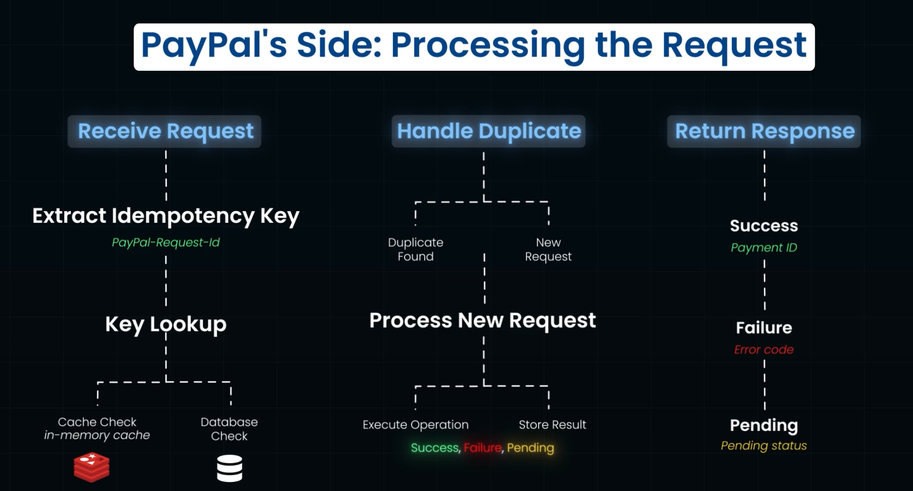

# Core Building Blocks

1. `CDN`
   1. Popular CDN Providers
      1. CloudFront
      2. Akamai
      3. Fastly
      4. Cloudflare
      5. MaxCDN
   2. References
      1. [CDN from Cloudflare](https://www.cloudflare.com/en-in/learning/cdn/what-is-a-cdn/)
      2. [ChatGPT Conversation on CDN](https://chatgpt.com/share/695b8f56-bf10-800c-87c5-edbbb3e91857)
2. `Rate Limiting`
   1. Rate limiting can be done based on
      1. User Based
      2. Location Based
      3. Server Based
   2. Rate Limiting Algorithms
      1. Window Based
      2. Sliding Window Based
      3. Token Bucket
      4. Leaky Bucket
3. `Proxy`
   1. A proxy is a special server sitting between the client and the server
   2. `Forward Proxy`
      1. Acts on behalf of the client. Client -> Forward Proxy -> Server
      2. Eg:- VPN
   3. `Reverse Proxy`
      1. Configured on based on the server like a gateway
      2. Client is not aware of whether it is proxy or server, it is the thinking it is talking to the server.
      3. Malicious attacks can be avoided
      4. Acts like a load balancer, serves static content and can also provide security.
4. `Scale Cube` - book Art of Scalability
   1. `x-axis` - increasing the number of instances and putting a load balancer at the front
      1. Horizontal Scaling
      2. Mainly in monolith-architecture
   2. `z-axis`
      1. each of the instances are responsible for only a subset of the requests.
      2. Router at the front routes the requests based on the request content (eg:- based on user id)
      3. Each instance can be scaled based on load
      4. The instances are split based on functionality, resource nature etc
   3. `y-axis` - Functional Decomposition (Micro-Services)
      1. The whole application is split based on functionality
      2. Each of the services can be scaled on x-axis way
5. `Idempotency`
   1. Operation can be executed multiple times but does not change the outcome
   2. Paypal - Processing a payment request
      
   3. Payment Failure
      1. Network Timeout
         1. Immediate Retry
         2. Exponential Backoff with maximum retries
         3. Error Handling and Notification is also done
   4. Idempotency keys had a lifespan (common practice is to set it for 24 hours - stripe removes after 24 hours)
6. `Bloom Filter`
   1. Hash Table
      1. Hashing - process of generating the hash using the data
         1. Handles Collision
         2. Deterministic
         3. Uniform Distribution
   2. To make search efficient for large datasets - we have bloom filters
      
      1. Optimizing Bloom Filters
         1. Right Number of hash functions
         2. Make your bit array larger
         3. Multiple Bloom Filter
      2. Example 1. PostgreSQL, Appache Cassandra 2. Web Platform 3. Bitcoin Wallets, Network Routers
         
7. `Pub-Sub`
   1. Four Components
      1. Publisher (Server)
      2. Subscriber (Clients)
      3. Topic - Client Subs on multiple topics. Client listen to the Topic
      4. Message - Server sends the data/operation publish through Topics
   2. Messages will be delivered once to the client - so idempotent operations should be done
   3. Messages will be followed in order - similar to queue
   4. Content-based Filtering
   5. Apache Kafka is a popular tool
