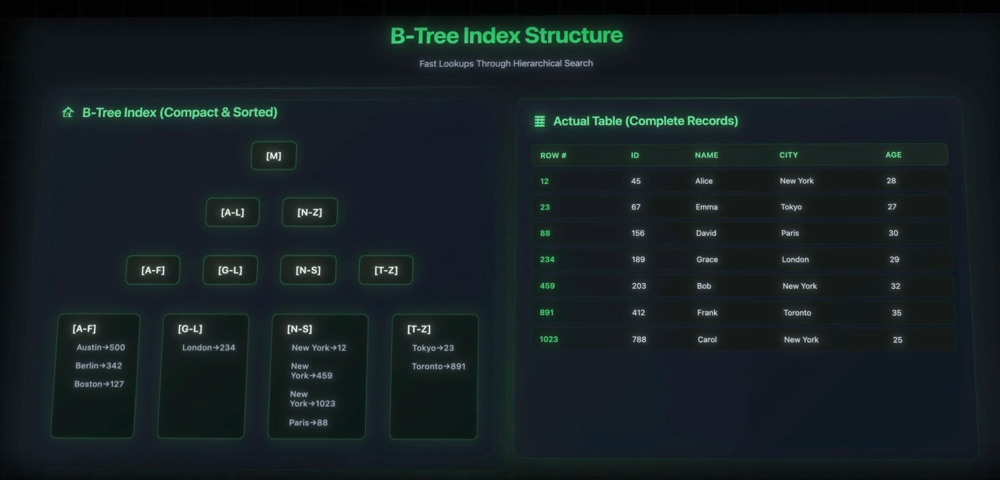
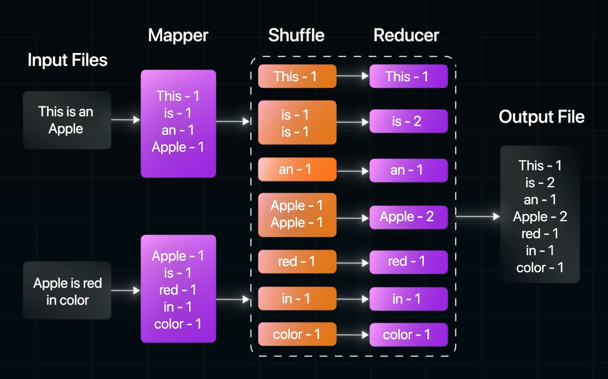

# Data and Storage

1. `Database Indexing`
   1. If I have a million records, searching a record is very slow if the data gets placed at the bottom of the table.
   2. To solve this, there is a special data structure called index.
   3. This index creates a searchable/sortable record of data which has pointers which points to the exact location of the data. This is mainly done for fast searching
   4. `B-tree` is the structure in which indexes are created. B-Tree -> Balanced Tree
      
   5. Happens in O(log(n)) time
   6. There are two types of indexes
      1. Primary Index - data is organized by this index. Only one per table and based on `primary key`
      2. Secondary Index - this is created by the user and has pointers to the primary key
      3. Global Secondary Index (GSI)
         1. Mainly in NoSQL dbs
         2. All the secondary index in SQL is GSI
   7. More indexes means more time during writes
   8. Rule:- Index your queries, not the tables
   9. Different Indexes
      1. Single
      2. Composite
      3. Text-Search
2. `Consistent Hashing`
   1. Split that data and store it as separate chunks - Horizontal Partitioning or Sharding
   2. Shards could be part of a disks or different disks or even a different machine
   3. To manage this a router and config server is something that is needed
   4. Ke Goals in managing the shards
      1. Even Distribution
      2. Add Shards
      3. Delete/Failed Shards
   5. To manage this a straight forward approach is simple hashing - this is not efficient
   6. To overcome this consistent hashing comes into picture simple to a number line concept
3. `CAP Theorem`
4. `Key Value Stores`
   1. Key Value is a non-relational
   2. Keys are always string and then values could be string, integer, array etc
   3. Example Key Value Stores
      1. DynamoDB
      2. redis (in-memory)
      3. ZooKeeper
5. `Blob Storage` - Binary Large Object (Manage Huge amount of unstructured data)
   1. Azure Blob
   2. S3 - Netflix uses this
   3. GCS - Youtube
   4. Tectonic
6. `Time Series`
   1. Track Server metrics
   2. Performance Monitoring
   3. Sensor Data
   4. Event Data
   5. Stock Prices
   6. Examples
      1. Influx DB
      2. Prometheus
7. `Graph DB`
   1. Neo4j
   2. Facebook uses this
8. `Partitioning`
   1. Organizing data
   2. Enables parallelism
   3. Maintaining is easier
   4. Horizontal Partitioning
      1. Divides tables by rows
   5. Vertical
      1. Divided tables by columns
   6. Functional Partitioning
      1. Based on business function
   7. Range or Time-based Partitioning (Partition Pruning)
   8. Trade-offs
      1. Slower performance if the query needs to be searching through multiple partitions
      2. Partition Skew
9. `Sharding`
   1. Divide the data across shards horizontally
   2. Hashing makes sure the data is evenly distributed manner using `shard key`
   3. During read, the query is send to the correct shard
10. `MapReduce Functions`
    1. Handling and processing large datasets across distributed systems
    2. Google White paper
    3. Idempotent is essential in Map, Reduce model
    4. Libraries used - `hadoop`
    5. Example
       
